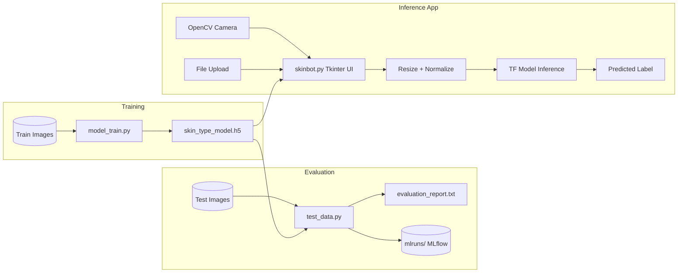
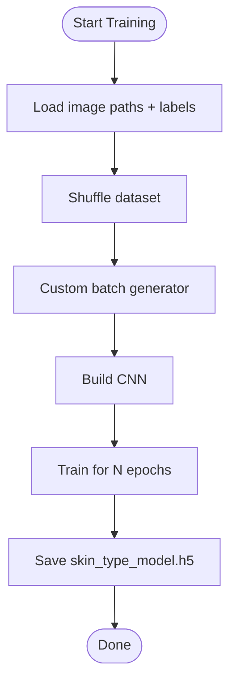
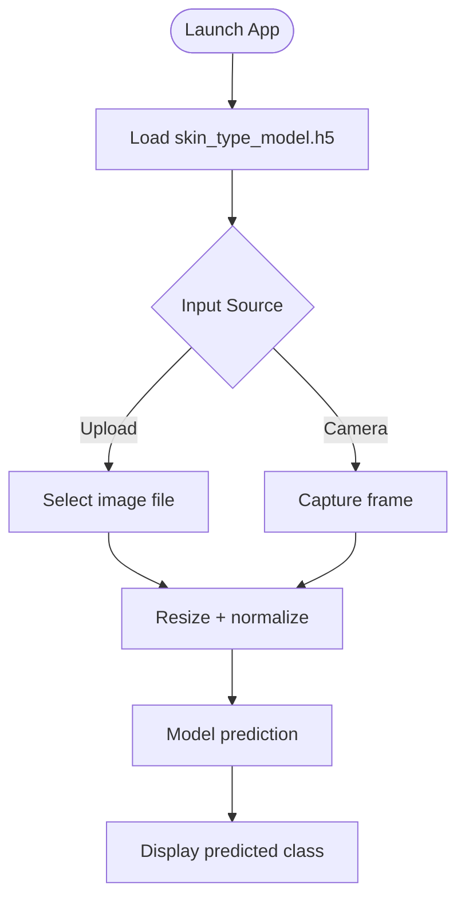

# Architecture Overview

Skinbot is a small, single-repo project that trains a CNN to classify skin types
(dry, normal, oily) and exposes inference through a Tkinter desktop UI. The
training and evaluation flows are standalone scripts and the UI consumes the
saved Keras model (`skin_type_model.h5`).

## Components

- `model_train.py`: Model training script; builds a CNN, loads images, trains,
  and saves `skin_type_model.h5`.
- `test_data.py`: Evaluation script; loads the saved model, runs inference on a
  test folder, logs metrics to MLflow, and writes `evaluation_report.txt`.
- `skinbot.py`: Desktop app; loads the saved model and predicts from uploaded
  images or a live camera capture.
- `skin_type_model.h5`: Saved TensorFlow/Keras model artifact.
- `mlruns/`: MLflow tracking data.

## Machine Learning Details

**Data organization**
- Training images: `train/<class_name>/*.jpg|*.png`
- Test images: `test/<class_name>/*.jpg|*.png`
- Class labels used by inference/evaluation are hardcoded as
  `['dry', 'normal', 'oily']`.

**Preprocessing**
- Images are resized to 128x128 and scaled to `[0, 1]` by dividing by 255.
- The training script defines an augmentation pipeline via
  `ImageDataGenerator`, but the current training loop uses a custom generator
  that does not apply those augmentations.

**Model architecture**
- 3x Conv2D + MaxPooling blocks (32, 64, 128 filters)
- Flatten -> Dense(128, ReLU) -> Dropout(0.5) -> Dense(softmax)
- Optimizer: Adam
- Loss: categorical crossentropy
- Metrics: accuracy

**Evaluation**
- Computes precision, recall, F1 (weighted), and a classification report.
- Logs metrics and the model to MLflow.
- Writes summary metrics to `evaluation_report.txt`.

## Mermaid Diagrams

### System Architecture

### Model Training Flow

### Inference Flow (UI)

## Configuration Notes

- `model_train.py` and `test_data.py` use hard-coded Windows paths for datasets.
  Update `train_dir` and `test_data_dir` for your environment.
- `skinbot.py` opens `cv2.VideoCapture(2)`. Change the index to match your
  camera device if needed.
- Training label order is based on `os.listdir(train_dir)`, while inference
  assumes `['dry', 'normal', 'oily']`. Keep directory ordering consistent or
  explicitly align class names to avoid mismatched labels.
